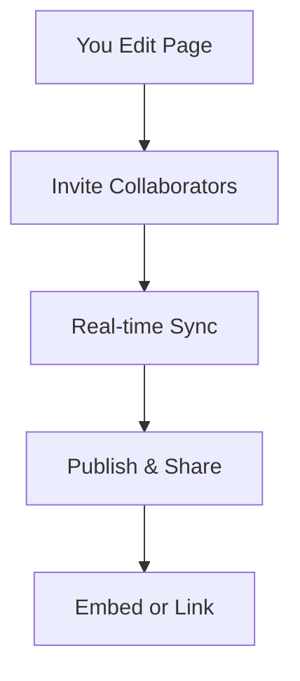

## Documentation Organization

LuLu CHU uses a hierarchical structure to keep your documentation intuitive and scalable. You organize content into projects, folders, and pages. Each project acts as a top-level container for related documentation sets.

<Columns cols={3}>
  <Card title="Projects" icon="package" href="/docs/projects">
    Group related docs into isolated projects for better management.
  </Card>
  <Card title="Folders" icon="folder" href="/docs/folders">
    Nest pages within folders to create logical navigation paths.
  </Card>
  <Card title="Pages" icon="file-text" href="/docs/pages">
    Individual MDX files form the core content units.
  </Card>
</Columns>

Use the sidebar navigation to reflect your folder structure automatically. For example, create a `concepts/` folder to house this page.

<Callout kind="tip">
  Start with a simple structure: `introduction.mdx`, `concepts.mdx`, `guides/`, and `api/`.
</Callout>

## Project and Version Management

Manage multiple versions of your documentation within a single project. You tag releases and switch between versions seamlessly.

<Tabs>
  <Tab title="Create Version" icon="plus">
    Navigate to project settings and add a new version tag like `v2.0`.

    ```bash
    # Example CLI command for version creation
    lulu project version create my-project v2.0
    ```
  </Tab>
  <Tab title="Switch Versions" icon="git-branch">
    Users select versions from the version dropdown in the header.

    <Image
      src="https://example.com/version-switcher.png"
      alt="Version switcher dropdown in the navigation bar"
      width="400"
      height="200"
    />
  </Tab>
</Tabs>

<Steps>
  <Step title="Set Up Versions" icon="settings">
    Go to project settings.

    Edit `lulu.config.json`:

    ````json
    {
      "versions": ["v1.0", "v2.0", "latest"]
    }
    ````
  </Step>
  <Step title="Publish Version" icon="upload">
    Deploy specific versions to custom domains or subpaths.
  </Step>
  <Step title="Deprecate Old Versions" icon="alert-triangle">
    Mark versions as deprecated to guide users.
  </Step>
</Steps>

| Feature | Benefit |
|---------|---------|
| Semantic Versioning | Track changes with `v{major}.{minor}.{patch}` |
| Draft Mode | Preview changes before publishing |
| Legacy Support | Keep old versions live indefinitely |

## Collaboration and Sharing

Invite team members to collaborate in real-time. Share public read-only links or embed docs in your apps.

<ExpandableGroup>
  <Expandable title="Permissions" default-open="true">
    Assign roles like Editor, Viewer, or Admin. Editors can create and edit pages, while Viewers access published content only.
  </Expandable>
  <Expandable title="Sharing Links">
    Generate shareable links with optional password protection.

    ```javascript
    // Example API for sharing
    const shareLink = await lulu.shareDoc({
      docId: "concepts-mdx",
      public: true,
      expires: "2024-12-31"
    });
    console.log(shareLink.url);
    ```
  </Expandable>
</ExpandableGroup>



<Callout kind="info">
  All changes are version-controlled with Git integration for full audit trails.
</Callout>

These concepts form the foundation. Master them to build scalable, collaborative documentation spaces in LuLu CHU.