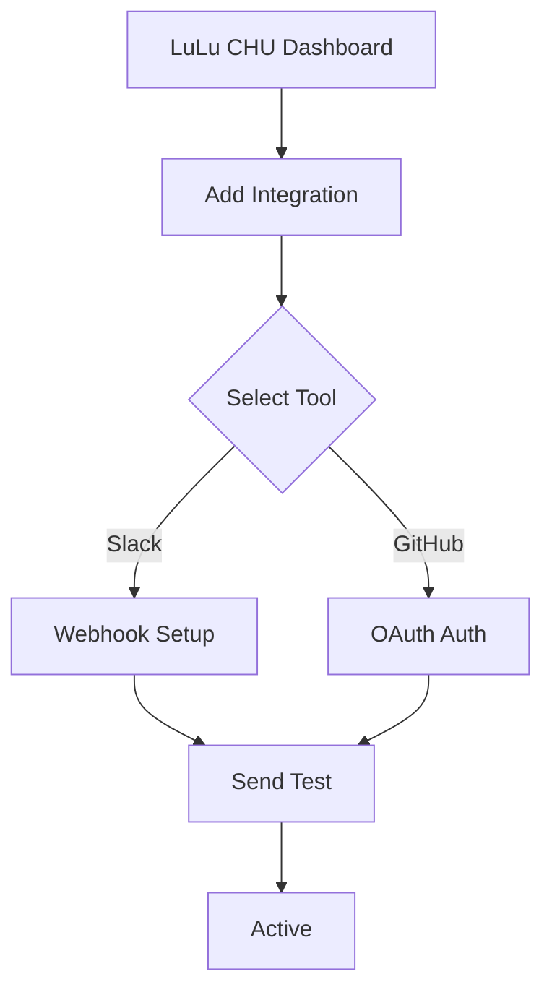

## Overview

Customize your LuLu CHU workspace to match your brand and workflow. Adjust themes, manage user permissions, and connect external tools seamlessly. Start with the admin dashboard to access all settings.

<Callout kind="tip">
  Back up your current configuration before making changes.
</Callout>

## Theme and Branding Options

Apply your brand colors and styles directly in the workspace settings.

<Columns cols={2}>
  <Card title="Primary Color" icon="palette" href="/docs/theme/colors">
    Set your main brand color, like `#3B82F6` for LuLu CHU blue.
  </Card>
  <Card title="Custom Logos" icon="image" href="/docs/theme/logos">
    Upload logos for headers and favicons.
  </Card>
</Columns>

### Apply Theme Changes

Follow these steps to update your theme:

<Steps>
  <Step title="Access Settings" icon="settings">
    Navigate to **Admin > Workspace > Themes**.
  </Step>
  <Step title="Edit JSON Config" icon="edit-3">
    Modify the `theme.json` file:

    <CodeGroup tabs="JSON,YAML">
```json
{
  "primaryColor": "#3B82F6",
  "fontFamily": "Inter, sans-serif",
  "logoUrl": "https://yourdomain.com/logo.png"
}
```
```yaml
primaryColor: "#3B82F6"
fontFamily: "Inter, sans-serif"
logoUrl: "https://yourdomain.com/logo.png"
```
    </CodeGroup>
  </Step>
  <Step title="Save and Preview" icon="eye">
    Click **Save** and preview changes in a new tab.
  </Step>
</Steps>

## User Permissions and Access

Control who accesses what in your LuLu CHU workspace. Define roles like `admin`, `editor`, and `viewer`.

### Role Configuration

Use the permissions UI or environment variables.

<Tabs>
  <Tab title="UI Method" icon="mouse-pointer">
    1. Go to **Admin > Users > Roles**.
    2. Assign permissions via checkboxes.
  </Tab>
  <Tab title="Environment Variables" icon="terminal">
    Set these in your `.env` file:

````bash
LULU_CHU_ROLES=admin:full,editor:write,viewer:read
LULU_CHU_DEFAULT_ROLE=viewer
````

  </Tab>
</Tabs>

<Callout kind="alert">
  Revoke admin access carefully to avoid lockouts.
</Callout>

## Integration with External Tools

Connect LuLu CHU to services like Slack, GitHub, and Zapier.

<Expandable title="Slack Integration" default-open="true">
  Configure webhooks for notifications.

  ```javascript
  const slackConfig = {
    webhookUrl: process.env.SLACK_WEBHOOK_URL,
    channel: "#docs-updates",
    username: "LuLu CHU Bot"
  };
  ```

  Test the connection in the integrations dashboard.
</Expandable>

<Expandable title="GitHub Sync">
  Enable automatic doc syncing from repos.

  ```yaml
  integrations:
    github:
      repo: "your-org/lulu-chu-docs"
      branch: "main"
      token: "${GITHUB_TOKEN}"
  ```
</Expandable>

### Integration Flow



Your workspace now reflects custom themes, secure permissions, and connected tools. Explore advanced options in the admin panel for further tweaks.