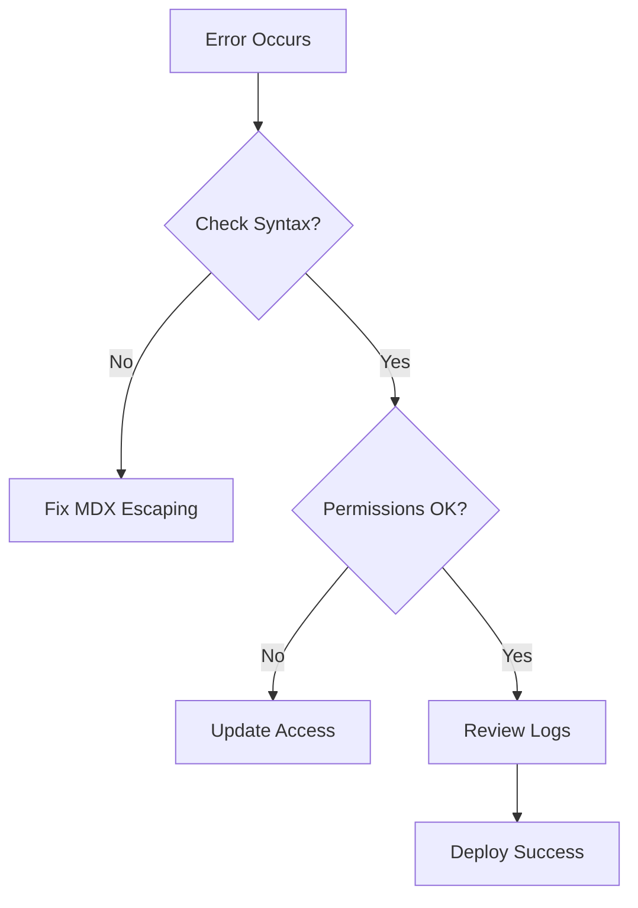

## Account and Login Issues

LuLu CHU provides secure account management. Use these solutions for common login problems.

<Callout kind="tip">
  Enable two-factor authentication (2FA) for added security on your LuLu CHU account.
</Callout>

<ExpandableGroup>
  <Expandable title="How do I reset my password?" default-open="true">

    Follow these steps to reset your password:

    <Steps>
      <Step title="Visit Login Page" icon="login">
        Go to the LuLu CHU login page at `https://lulu-chu.com/login`.
      </Step>
      <Step title="Click Forgot Password" icon="key">
        Select the `Forgot Password?` link.
      </Step>
      <Step title="Enter Email" icon="mail">
        Provide your registered email address and submit.
      </Step>
      <Step title="Check Inbox" icon="inbox">
        Follow the link in the email to set a new password.
      </Step>
    </Steps>

  </Expandable>

  <Expandable title="What if I cannot receive the reset email?">

    Check your spam folder. If no email arrives after 5 minutes, contact support at `support@lulu-chu.com` with your account email.

  </Expandable>

  <Expandable title="How do I enable 2FA?">

    Navigate to Account Settings > Security. Scan the QR code with your authenticator app like Google Authenticator.

  </Expandable>
</ExpandableGroup>

## Editing and Publishing Docs

Edit MDX files directly in LuLu CHU's editor or via Git integration.

<Tabs>
  <Tab title="Web Editor" icon="edit-3">

    Use the built-in editor for quick changes.

    <CodeGroup tabs="MDX,Preview">
      ```mdx
      ## Welcome

      Start writing your docs here.
      ```

      ```mdx
      ## Preview

      This renders as a heading with content below.
      ```
    </CodeGroup>

  </Tab>
  <Tab title="Git Workflow" icon="git-branch">

    Connect your GitHub repo for version control.

    ```bash
    git clone https://github.com/your-org/lulu-chu-docs.git
    # Edit files locally
    git add .
    git commit -m "Update FAQ"
    git push origin main
    ```

    Publishing happens automatically on push.

  </Tab>
</Tabs>

<Callout kind="success">
  Preview changes before publishing to ensure `MDX` syntax renders correctly.
</Callout>

## Troubleshooting Common Errors

Resolve issues step by step.

### Parsing Errors in MDX

Common causes include unescaped special characters like `{` or `<`.

````mdx
<Steps>
  <Step title="Check Escaping">
    Wrap variables in backticks: `{API_KEY}` instead of {API_KEY}.
  </Step>
  <Step title="Validate Frontmatter">
    Ensure no blank lines: 
    ```
    ---
    title: Page
    ---
    ```
  </Step>
</Steps>
````

### Publishing Failures

<Columns cols={2}>
  <Card title="Check Permissions" icon="shield" href="/docs/permissions">
    Verify write access to your repo.
  </Card>
  <Card title="Build Logs" icon="file-text" href="/docs/logs">
    Review deployment logs for errors.
  </Card>
  <Card title="Clear Cache" icon="refresh-cw" href="/docs/cache">
    Invalidate cache after syntax fixes.
  </Card>
</Columns>



For persistent issues, open a ticket with build logs attached. LuLu CHU support responds within 24 hours.